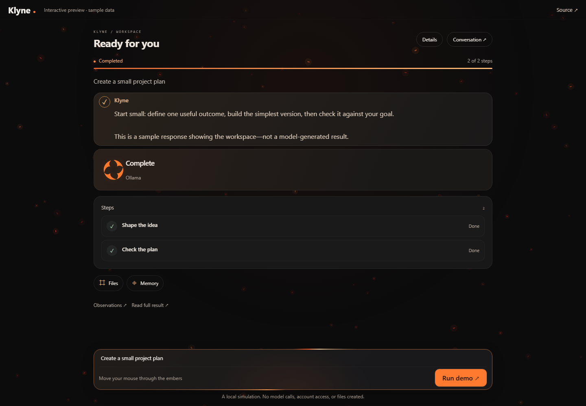

# Klyne

**A local-first AI workspace. A little spark. Something real.**

Give Klyne a task, watch the steps unfold, and inspect the result. Built in Rust with a simple browser interface, local model support.

[](https://isaacnewtonne.github.io/Klyne/)

### [Open the interactive workspace](https://isaacnewtonne.github.io/Klyne/)

Run a sample task, switch between conversation and workspace, or open Details. The demo uses the real presentation code with simulated task data. It makes no model calls and cannot access your computer. GitHub README files cannot run JavaScript; the live experience opens on GitHub Pages.

## What Klyne does

- **Work you can follow.** Persisted task dependencies, progress, evidence, and a readable final answer.
- **Models you choose.** Ollama, Codex, and OpenCode connections; a separately configured fallback can handle model-request failures.
- **Tools with explicit access.** Files, browser automation, desktop controls, terminal commands, saved APIs, and curated MCP integrations.
- **Recovery grounded in evidence.** Completed steps survive restarts. Known pre-dispatch connection failures can switch to desktop observation. Uncertain actions are preserved instead of blindly repeated.
- **Checks beyond a model's claim.** Caller-owned file contracts, supported desktop focus/field checks, and a first Notepad save-reconciliation adapter.
- **App results checked at the destination.** After desktop or browser actions, a reviewer inspects the result with read-only tools and cites the observed destination. This shared path supports different apps without a messaging-app allowlist. Observed results are labeled Reviewed; independent acceptance checks are labeled Verified. Missing evidence prompts a destination check, not another send.
- **A quieter interface.** Visual progress, compact steps, optional details.
- **Fewer redundant questions.** Klyne uses prior clarifications and inspects app display names instead of treating capitalization alone as a different destination. Missing access, sign-in and genuine target ambiguity still need your input.
- **One command to open, one window to close.** On Windows, `klyne` opens a dedicated app window. Closing its last window stops Klyne and its owned child processes, including running jobs.
- **Independent work continues.** Tasks waiting for approval block their dependents while other ready tasks continue. Approval cards appear when the run pauses, and approval resumes the blocked work.
- **Experiment history the app can reuse.** Repository-specific records preserve candidate patches and test evidence, including rejected attempts. Relevant history is recalled automatically and checked for changes before reuse.

Klyne is under active development. Desktop automation currently targets Windows. App coverage depends on available adapters, accessibility controls, and verifiable results; arbitrary message delivery, purchases, deletes, and every application's save behavior are not universally verified. A fallback model using the same Ollama service still shares that service's failure modes.

## Execution guarantees

A September 2026 technical audit ([AUDIT-2026-09-13.md](AUDIT-2026-09-13.md)) drove nine upgrade phases. The [UX and autonomy re-audit](docs/audit-2026-09-13-ux-autonomy.md) identifies remaining release blockers; passing fixtures does not establish unattended general-purpose reliability.

- **Choose command autonomy once.** Settings offers exact-command approval or autonomous Terminal commands for the conversation. Terminal off and read-only review still deny execution. Credentials remain origin-bound; DELETE approvals bind the resolved origin, path/query and body.
- **Shared policy and expiring approvals.** Planner, workers and reviewer receive the same host-owned policy. Approval cards expire after 15 minutes and bind the request to its goal, permissions and supported action inputs; stale or changed requests require renewed approval. See [policy and approvals](docs/shared-policy-and-approvals.md).
- **Budgets survive Resume.** Steps, tokens and estimated cost remain shared across workers and review rounds for the same goal. Normal resumptions also preserve active elapsed time. These are execution limits, not exact billing caps; an in-flight provider call can overshoot them.
- **Recorded effects.** Failed commands retain uncertain state in Studio and the core runtime. Controlled benchmark diagnostics have explicit host recovery rules. File writes and patches issue destination-bound receipts and receive fresh completion checks; broader results remain model-reviewed.
- **Qualified extensions.** Tool qualification binds argv, the resolved executable, referenced file arguments and declared artifacts. Runtime attestations now execute approved test argv and require unchanged candidate bytes. Tests prove execution, not arbitrary test quality or OS isolation.
- **Automatic crash recovery.** The supervisor restarts Studio with backoff, preserves checkpoints, and stops after three unsuccessful restart attempts in a crash loop.
- **Protected improvement experiments.** Candidates run in disposable worktrees against frozen baseline tests and build configuration. Weakening those checks is rejected. A specific improvement is marked verified only when an independently configured acceptance test fails on the baseline and passes on the candidate, with regression checks still passing. Retained branches remain available for review; they are not automatically merged or activated. See [evaluation and experience records](docs/protected-improvement-evaluation.md).
- **Verified in tiers.** Deterministic suites, Chrome-gated browser tests, ignored live tests, and Windows desktop checks are documented in [docs/test-tiers.md](docs/test-tiers.md) with environment-recorded baselines.

Known limits: desktop/API consequential actions beyond shell and DELETE have no host-classifiable approval gate; unsupervised model task-success rates are not measured; supervised processes are lifetime-managed, not sandboxed.

## Run locally

Install a current stable Rust toolchain with edition-2024 support and the platform's native build tools. On Windows, use the MSVC toolchain and Visual Studio C++ build tools. Install and start Ollama if you want local inference; choose a model that fits your hardware.

```powershell
git clone https://github.com/IsaacNewtonne/Klyne.git
cd Klyne
cargo build --locked -p klyne-studio --bins
powershell -NoProfile -ExecutionPolicy Bypass -File scripts/install-command.ps1
klyne
```

The Windows installer adds `klyne.cmd` beside Cargo in its existing PATH directory. From any folder, type `klyne` to open a dedicated app window using Edge or Chrome. Closing the last Klyne app window stops Studio, its supervisor, and their owned child processes, including running jobs. Your ordinary browser and independently running services stay open. You can close PowerShell while the app window remains open. Keep this checkout in place; the command points to its launcher. `klyne -NoBrowser` explicitly runs as a background server without window-close shutdown.

Select your provider in Settings and check the connection. Enable only the tools needed for your task. Terminal and desktop access can act on your real computer; the public demo has neither capability.

The runtime stores local conversations and generated artifacts under `workspace/`, which is excluded from Git. No model weights are bundled. Chrome or Edge is needed for browser workflows; Node/npm is needed for the curated browser MCP adapter. See [provider setup](docs/studio-providers.md) and [app connections](docs/app-connections.md).

## Development

```powershell
cargo test --locked -p harness-core
cargo test --locked -p klyne-studio --bin klyne-studio --test chat --test runtime -- --test-threads=1
```

Studio browser tests require an installed browser. The optional live MCP test is ignored by default. Windows desktop fixture checks can be run with `powershell -MTA -NoProfile -File scripts/test_desktop_recovery.ps1`; they operate a disposable test window. With Edge installed, `powershell -NoProfile -ExecutionPolicy Bypass -File scripts/test-app-close.ps1` opens and closes a disposable app window and verifies its observed process tree exits.

Build and preview the static demo without starting Klyne:

```powershell
python scripts/build_site.py
python -m http.server 8080 --directory site
```

Open **http://localhost:8080**. The Pages workflow rebuilds presentation assets from Studio when publishing. Configure GitHub Pages to use **GitHub Actions** for deployment.

## Explore the project

| Area | Guide |
| --- | --- |
| Studio and providers | [Workspace](docs/studio.md) ? [Providers](docs/studio-providers.md) |
| App integrations | [MCP and desktop routes](docs/app-connections.md) |
| Recovery | [Recovery service](docs/recovery.md) |
| Policy, approvals and budgets | [Shared execution policy](docs/shared-policy-and-approvals.md) |
| Improvement experiments and history | [Protected evaluation](docs/protected-improvement-evaluation.md) |
| UX and autonomy implementation | [Audit fixes and validation](docs/autonomy-implementation-2026-09-14.md) |
| Architecture and next steps | [Autonomy roadmap](docs/autonomy-roadmap.md) |
| Audit and test tiers | [2026-09 audit](AUDIT-2026-09-13.md) · [Test tiers](docs/test-tiers.md) |
| Core runtime | [Harness overview](docs/harness-overview.md) |

The Rust workspace includes the core runtime, providers, browser control, benchmarks, memory, experiments, CLI, and Studio. The model proposes actions; the host owns execution, permissions, persistence, and independent checks.
