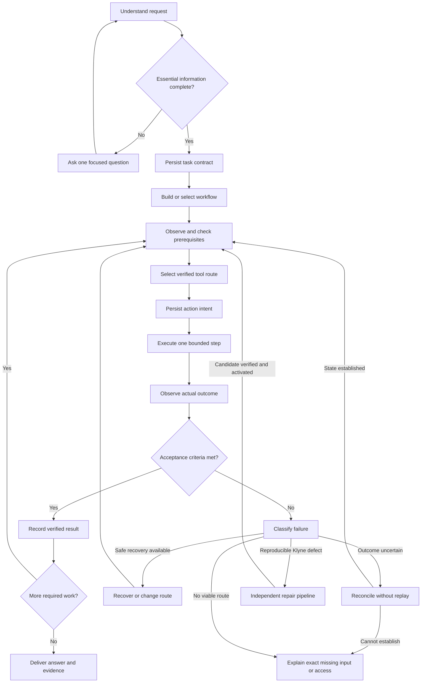

# Klyne autonomy roadmap

Research and code review: 12 September 2026. This is a proposed implementation plan, not a claim that these features already exist.

## Implementation progress: first foundation

The first document-save adapter recognizes Notepad `CTRL+S` from host-observed process metadata and captures the existing caller-owned task contract before dispatch. It supports whole-file contents and file digests, not partial-range checks. After an error or runtime restart, the host may read the contracted files under the conversation's filesystem policy and resolve the Save only if every criterion matches the unchanged contract. No Save shortcut is repeated. Startup evidence does not require the old editor window to survive because the durable file is the result being checked. Missing, partial, out-of-workspace, stale, or mismatching files preserve uncertainty. This currently requires an explicit task contract (or the existing deterministic file-instruction grammar); it does not infer arbitrary document formats, browser submissions, other editors' save semantics, or message-delivery receipts. The restart integration test uses a seeded interrupted checkpoint and a real saved file, not a live Notepad save.

Startup recovery now attempts read-only reconciliation for supported pending desktop focus/fill actions from conversations that were running when the runtime stopped. New actions capture the window's process ID, process start time, title, and dispatch timestamp. A fresh observation must match that identity and the operation postcondition, and the intent must be no older than ten minutes. Only then is the pending action cleared transactionally with reconciliation evidence before the graph resumes. Legacy records, unsupported effects, changed/inaccessible process identities, stale intents, stopped/blocked conversations, and inconclusive observations remain unresolved. Immediate reconciliation also requires the same identity check. No input is sent by reconciliation itself.

Automatic route switching now handles MCP session setup failures and API connection-establishment failures that the transport identifies as occurring before request dispatch. With Desktop access enabled, the host disables that failed route for the current task, records the switch, obtains a fresh desktop observation, and lets the worker locate the intended app/document/account and replan. It does not translate or replay the failed operation. Switches are bounded to once per route per task and persist across resume. Stop, reviewer mode, missing Desktop access, and uncertain post-dispatch failures prevent switching. MCP tool-reported errors are now conservatively uncertain too. A desktop session may differ from the MCP browser profile; the route evidence explicitly requires target/account identification.

Desktop reconciliation now covers interrupted focus and accessible field-fill calls across applications. Following a call error, one fresh observation may establish the requested foreground/restored window or exact field value without repeating input. Field evidence must identify the exact control in the intended foreground window and must be untruncated. The Windows helper now marks truncated values. Unsupported operations, missing evidence, Stop, and mismatched state preserve uncertainty. This immediate reconciliation does not automatically reconcile arbitrary saved actions after a runtime restart, nor does it prove sends, deletes, purchases, document saves, or API writes. Those require destination-specific receipts or postconditions.

The controller now persists a typed recovery decision for uncertain effects, user stops, step-budget exhaustion, known desktop precondition failures, exhausted desktop recovery, missing worker input, and unclassified failures. Uncertain pending effects override stop/budget classifications and require reconciliation. Only the existing known-not-applied desktop path continues automatically with fresh observation and bounded replanning; this policy does not authorize action replay or automatic route switching. Worker `needs_input` decisions pause the current graph step; a normal answer resumes it unless the caller explicitly requests a new task with `resume:false`. Production displays the next-step guidance, and model context includes the recovery decision. Updating execution limits now preserves saved graph history and review progress. Other error types, including permissions not yet represented by typed signals, remain unclassified and blocked for inspection.

The worker loop now schedules a persisted dependency graph. Plans may specify `depends_on` using 1-based step numbers and `expected_result` text; omitted dependencies preserve the prior sequential behavior. Host validation rejects cycles, duplicate edges, self-dependencies, and missing targets before execution. Independent ready steps still run serially. Completed steps are skipped on resume; pending uncertain actions retain the existing resume block. Each step saves its evidence range, and repair rounds preserve earlier plans under `execution.previous_plans`. Production displays dependencies and expected results and draws edges between dependent steps. Expected-result prose is not a deterministic verifier, and `Done` remains a worker completion report subject to review and any task contract. Automatic failure classification and route-switching decisions remain future work.

Operation verification now has a reusable predicate format over adapter-owned observations: exact JSON values and uniquely identified rows. Results distinguish `verified`, `unmet`, and `unknown`; missing fields and duplicate identities cannot pass. No current-state predicate declares an interrupted effect safe to replay. The first live desktop integration is `desktop_focus`: the intended window must be foreground and explicitly non-minimized in the fresh observation. Its postcondition is persisted with pending intent before execution. A failed check preserves the unresolved action and records host evidence. Other desktop operations retain existing behavior; document-save and message-delivery verifiers, automatic reconciliation, and execution graphs are not implemented by this slice.

Shared adapter descriptions now cover MCP, saved APIs, and desktop controls. Each reports its target, discovery/action tools, connection-check scope, verification requirements, and no-automatic-replay policy. Installed-app selection supplies this description and route-specific instructions to the composer. Saved API listings expose the same structure to the model. `POST /api/apps/select` accepts an optional explicit `api_connection` alongside `app_id`; it requires saved operations, performs no trial write, and reports those operations as untested. Without that explicit link, selection retains the curated MCP probe followed by desktop fallback. API binding is currently available through this endpoint, not a new picker control, and is not persisted as an installed-app association.

These descriptions document capabilities and limits; they are not a universal result verifier or an execution graph. Runtime permissions and pending-action guards remain authoritative. The next adapter work is operation-specific postconditions and reconciliation implementations, followed by routing based on the particular task's required capabilities rather than connection availability alone.

The production conversation store now records action lifecycle events in the same SQLite transaction as pending state and evidence. This is shared across desktop controls, MCP, app APIs, and process actions that use the pending-action controller; it is not tied to Zalo. Repeated saves do not create repeated dispatch records, unresolved intents cannot be replaced, and explicit reconciliation preserves its inspection note. A returned call is recorded as `returned`, not `verified`. SQLite writes explicitly request FULL synchronization. Existing databases gain the additive event table on their next write; older historical actions are not reconstructed.

The architecture targets arbitrary apps through common action contracts and capability adapters. Each adapter should declare how it discovers targets, invokes an operation, observes its result, and reconciles an interrupted operation. MCP/API receipts can establish an app-specific postcondition; desktop screenshots or accessibility trees need an explicit postcondition check. Transport availability alone never proves full app coverage. Where reliable reconciliation is unavailable, the shared controller must preserve uncertainty. The synthetic messaging fixture is one test domain, not the universal action schema.

Studio now persists caller-owned task contracts and independently verifies supported file criteria before accepting model-reported completion. Failed checks feed back into the repair loop; a second unsupported completion blocks the task. General tasks without a contract remain model-reviewed, not host-verified. The production result marks independently checked success as Verified.

The existing deterministic instruction grammar creates a file contract for `write file proof.txt :: checked` or `create file proof.txt with content checked`. API callers can also supply a `contract` alongside the instruction, for example `{"goal":"Create the requested artifact","criteria":[{"FileContents":{"path":"proof.txt","expected":"checked"}}]}`. The goal must exactly match the instruction. Contracts cannot be replaced while resuming a task.

A reusable SQLite action journal pins message intent, records dispatch before sending, and reconciles destination receipts after interruption. Uncertain dispatched actions are not automatically resent. Synthetic tests cover minimized/background/modal states, authentication blocks, missing message content, lost acknowledgements, wrong recipients, duplicate receipts, and actual subprocess exits at four effect boundaries. These simulated app states do not prove real desktop automation reliability.

Validation: 43 Studio unit/integration/runtime tests and five synthetic messaging tests passed. The live-browser MCP test remains opt-in; the ignored crash helper is invoked by the process-exit test. This is a foundation for phases 1 and 2, not completion of the roadmap. The new messaging journal is not yet connected to Zalo or other live app adapters; general action recovery, execution graphs, and a separately provisioned recovery model remain future work.

## Recommendation

Evolve Klyne's existing Rust runtime into a durable, evidence-driven task controller. Keep the local-first design and separate recovery service. Give the model bounded decisions inside a host-controlled execution loop. Make progress, success, retry eligibility, and rollback depend on recorded state and checks.

Do not begin with a framework rewrite or a large agent team. First make one task reliable through interruptions. Then reuse that machinery for more tasks, app integrations, and self-repair.

Here, **harness engineering** means the runtime surrounding model calls: state, context, tools, scheduling, permissions, verification, and telemetry. **Loop engineering** means designing how execution observes progress, chooses the next step, detects failure, and stops or recovers. **Graph engineering** means explicit execution dependencies and evidence/capability relationships; it is more than drawing nodes in the production UI.

## Research findings and their relevance

| Source | Finding | Klyne implication |
|---|---|---|
| [Anthropic: long-running harnesses](https://www.anthropic.com/engineering/effective-harnesses-for-long-running-agents) | Incremental work, explicit feature requirements, environment checks, and durable handoffs helped work continue across sessions. | Store the task contract, verified progress, and next action outside chat history. |
| [Anthropic: application harness design](https://www.anthropic.com/engineering/harness-design-long-running-apps) | Separate evaluation and concrete acceptance criteria improved results; extra orchestration also had costs and needed testing. | Add outcome checks where failure matters; avoid planner/worker/reviewer overhead for a greeting. |
| [LangGraph: graph API](https://docs.langchain.com/oss/python/langgraph/graph-api) | State, nodes, conditional edges, reducers, and replay-aware execution make control flow explicit. | Use typed workflow nodes and host-validated transitions, implemented incrementally in Rust. |
| [LangGraph: persistence](https://docs.langchain.com/oss/python/langgraph/persistence) | Persisted execution state supports continuity across graph runs. | Checkpoint node state and dependencies, not merely a conversation status. |
| [Anthropic: agent evaluations](https://www.anthropic.com/engineering/demystifying-evals-for-ai-agents) | The actual environment outcome differs from what a transcript claims; code, model, and human graders serve different purposes. | Verify artifacts and application state before declaring success. Calibrate model judgments against fixtures and human review. |
| [Anthropic: context engineering](https://www.anthropic.com/engineering/effective-context-engineering-for-ai-agents) | Context selection, compaction, and external memory are engineering concerns. | Protect current app state and task requirements from verbose historical tool output. |
| [Ollama: structured outputs](https://ollama.com/blog/structured-outputs) | JSON-schema-constrained output can structure model decisions. | Use role-specific schemas and semantic validation. Valid JSON still does not prove the action is correct. |

These sources establish useful patterns, not measured performance guarantees for Klyne's local model. The architecture below is my recommendation based on those patterns and the current code.

## Current foundation and gaps

Inspected `apps/studio/src/chat.rs`, `chat_store.rs`, `desktop.rs`, `mcp.rs`, the recovery documentation, and the live recovery configuration.

| Area | Existing foundation | Gap to address |
|---|---|---|
| Execution | Planner, sequential workers, reviewer, step/time budgets | Model prose still drives too much completion and recovery behavior. |
| Persistence | Transactional SQLite chat metadata/history; pending-action checkpoints | History is mutable and lacks a complete immutable action lifecycle. |
| Desktop | Fresh observations, focus/restore, geometry checks, accessible actions, bounded recovery | Missing app context previously caused false conclusions; observation relevance and outcome checks need systematic coverage. |
| Connections | MCP discovery and checked Chrome/Edge adapters; desktop fallback | Most discovered integrations cannot yet be installed, tested, and reused through a general adapter lifecycle. |
| Recovery | Separate Python guardian, isolated candidate source, tests, staging, startup rollback | Incident coverage is concentrated on model-request failures; functional regressions need post-activation checks and reconciliation. |
| Model independence | Configurable local fallback | Live primary repair/fallback configuration shares the same model and `127.0.0.1:11434`. A second model alone would still share the server and hardware. |
| Results | Desktop review now requires an explicit achieved outcome | An `achieved` label remains a model assertion until tied to independently checked evidence. |

## Target execution graph

The model proposes decisions. The host owns graph validity, grants, action dispatch, checkpoints, retry limits, and terminal status.

## Three graphs with distinct responsibilities

**Execution graph.** Each node records its ID, type, dependencies, input references, acceptance criteria, required grants, resource locks, attempt budget, timeout, verifier, and recovery choices. Initially keep ordinary task dependencies acyclic. Represent bounded recovery explicitly; do not allow arbitrary cycles generated by the planner. Replanning creates a new graph revision and preserves completed work and the original goal.

**Capability graph.** Relate an installed app/version to its available MCP, API, CLI, and desktop routes. Each route records provenance, installation version, authentication needs, verified operations, last check, failures, and fallback options. Route choice must fit the specific operation; a browser adapter is not automatically full control of browser settings. A route can be discovered, installed, connected, operation-tested, degraded, or unavailable.

**Evidence graph.** Link each claim and acceptance criterion to observations, artifacts, verifiers, and action IDs. Record freshness and the app/file version observed. Screenshots and app window handles expire; historical text must not overwrite current observations. Begin with SQLite tables and references. Introduce a dedicated graph database or GraphRAG only if retrieval measurements justify it.

## Four execution loops

### 1. Action loop

Observe → validate prerequisites → execute once → observe → verify. Prefer exact API results or accessible controls, then grounded visual interaction. For a minimized app, restore and focus it before searching its controls. For an absent app, discover the installed ID and launch it. For a dialog, identify its owner and purpose before choosing an action.

Every action has a structured envelope: `action_id`, `task_id`, `node_id`, `attempt`, `input_ref`, `expected_effect`, `replay_class`, `deadline`, and `verification_ref`.

Use lifecycle states such as `prepared`, `dispatched`, `observed`, `verified`, `failed_before_dispatch`, and `outcome_unknown`. Persist intent before dispatch. A crash after dispatch does not mean the action failed.

### 2. Progress loop

After a node or a short action window, assess progress using task-specific evidence: a required file exists, the intended record changed, a new screen was reached, or an acceptance criterion passed. Model confidence, elapsed tokens, and repeated observations alone are not progress.

Detect repeated action/state fingerprints, repeated errors, and oscillating routes. Retry policy depends on the failure class. A stale coordinate warrants re-observation; an unavailable model warrants backoff; an uncertain send warrants reconciliation. Start with bounded policies and tune from traces. Wait on external changes with persisted backoff rather than repeatedly invoking the model.

### 3. Recovery loop

Use the least disruptive remedy first: refresh observation → restore/focus → reconnect adapter → choose another verified route → restart an owned helper → diagnose a reproducible code defect.

Do not send every failed task into code repair. Missing message content, expired authentication, or unavailable network access are not necessarily software bugs. Persist the failure class, evidence, attempted remedies, and exact resumption condition. Continue independent graph nodes where possible.

### 4. Improvement loop

Recurring failure → sanitized reproduction → regression fixture → candidate fix → independent evaluation → controlled activation → functional check → retain or roll back.

A candidate cannot weaken its own acceptance criteria, edit protected baseline tests, or certify itself. A startup health check is necessary but insufficient: verify the repaired path after activation. Preserve previous binaries and compatible database checkpoints; schema rollback requires an explicit compatibility or restore strategy.

## Completion must be computed from evidence

Replace one broad `Completed` decision with a host-computed result: `achieved`, `partial`, `blocked`, `failed`, `cancelled`, or `outcome_unknown`. A model may propose a status and explanation, but required acceptance checks determine whether `achieved` is available.

Examples:

- Greeting: the delivered response itself addresses the user; no work graph or fictional worker report is needed.
- File edit: independently read back the relevant content; run behavior checks when appropriate.
- App interaction: confirm the target state, not just successful input dispatch.
- Message: bind recipient and body separately; establish both before sending, and inspect the result afterward. “Message Jodi” does not provide a message body.
- Subjective writing/design: use a calibrated rubric, make judgment limits visible, and do not present model approval as objective proof.

Exactly-once external effects cannot be guaranteed for arbitrary GUIs. Use an idempotency key where the destination supports it. Otherwise reconcile the destination state. If sending may have succeeded but cannot be verified, preserve uncertainty and do not resend automatically.

## Local models and independent recovery

Benchmark the installed model against the actual workflow suite before choosing replacements. Compare task success, invalid decisions, time to first useful action, latency, and memory consumption. Keep schemas small, expose only relevant tools, and reserve context for the goal, current node, current app state, and unresolved effects.

Install and evaluate the requested second local repair model. Run it through a separately supervised inference process/endpoint. Reserve enough memory for recovery, or use a tested CPU-capable repair configuration when the primary GPU workload is unhealthy. A separate endpoint improves isolation but does not survive loss of the whole OS or shared hardware.

The guardian must also have deterministic recovery operations that require no model: health checks, log capture, restart with backoff, configuration restoration, and binary rollback. Keep its known-good launcher and configuration outside the candidate's editable scope. Do not let a repair rewrite the watchdog that judges it.

For sustained operation, add explicit startup/reboot recovery, durable scheduled work, pause/resume, disk/log limits, package inventory, and migration checks. Expensive maintenance should run when idle, with CPU/GPU limits and a visible history of changes.

## Implementation sequence

| Phase | Concrete work | Completion gate |
|---|---|---|
| 0: Baseline | Convert observed failures into fixtures; record current success, latency, retries, and false completion. | Reproducible suite covering chat, files, app state, interruption, and recovery. |
| 1: Task truth | Add task contracts, typed outcomes, evidence references, and domain verifiers. Separate conversation-only replies. | No false success in the defined failure fixtures; every achieved task has acceptance evidence. |
| 2: Durable action engine | Add action lifecycle records, replay classification, reconciliation, context budgeting, and centralized failure policies. | Crash/restart at every action boundary without losing intent or duplicating fixture writes. |
| 3: Workflow and capability graphs | Add dependency scheduler, graph revisioning, per-app/session locks, adapter lifecycle, and dynamic production UI. | Resume only unfinished nodes; switch routes without replaying uncertain effects. |
| 4: Independent self-repair | Separate local inference path; broaden incident taxonomy; add functional canaries and rollback checks. | Inject a primary inference outage and a bad candidate; repair/rollback while preserving task state. |
| 5: Sustained autonomy | Add startup recovery, scheduled work, memory expiry, successful workflow reuse, maintenance budgets, and gradual adapter expansion. | A defined unattended soak suite completes with bounded resources and an auditable history. |

Phases are dependency order, not calendar promises. Introduce parallel workers only after resource isolation and graph joins are proven. On one shared desktop, keep input serial; parallelize independent research or isolated filesystem work where it measurably helps.

## Suggested code boundaries and migration

Framework decision: keep Rust and SQLite for the first implementation. LangGraph is a useful reference for graph state, routing, and persistence, but adopting its Python runtime would add an orchestration boundary to the existing Rust tool host. Reconsider that tradeoff only if a small prototype demonstrates a substantial reduction in complexity. A distributed workflow platform is not the first requirement for a single-machine desktop assistant; reassess if Klyne gains remote workers or multi-machine execution. Do not add a graph database simply because workflows are represented as graphs.

Keep `apps/studio` as the UI and application host. Extract execution types and scheduling into `crates/harness-core` incrementally. Proposed components: `TaskContract`, `ActionJournal`, `OutcomeVerifier`, `RecoveryPolicy`, `ContextBuilder`, and `WorkflowScheduler`.

Extend persistence with versioned tables for tasks, nodes, edges, action events, acceptance checks, and evidence references. Keep existing chats readable. Import old snapshots as legacy checkpoints; do not fabricate verification evidence for historical completed tasks. Append new lifecycle events transactionally, and derive the current UI state from those events.

Start with one vertical workflow behind a feature flag, compare it with the current path, then migrate more task classes. Keep a rollback-compatible reader during migration. The production diagram should render actual node status and dependencies, rather than infer an execution graph from worker labels.

## First implementation slice

Use a synthetic messaging app, not personal conversations. The contract contains app identity, recipient, message body, and a delivery criterion. Exercise foreground, background, minimized, tray-hidden, modal-blocked, disconnected, and ambiguous-recipient states. Inject a crash immediately before and after sending. Verify the message count and recipient independently.

This single slice tests the most important architectural promises together: correct intent, app discovery, recovery, durable state, no duplicate effects, truthful completion, and understandable UI. Then reuse it for document editing and browser workflows.

## Release measurements

Track verified task success, false-success rate, duplicate effects, recoverable-incident resolution rate, user interventions per task, restart recovery time, p50/p95 latency, model/context consumption, and rollback success. Break results down by app, route, model version, and fault type.

Initial proposed gates: zero false completion and zero duplicate sends in the deterministic fixtures; all injected action-boundary restarts reconcile correctly; all bad-candidate fixtures roll back; and improved verified task success over the recorded baseline without an unexplained latency regression. These are test targets, not claims about arbitrary real-world tasks.

Maintain held-out cases and repeat nondeterministic model trials. Record failing trials, not just the best run. Successful fixes should add regression coverage and versioned recovery knowledge; repeated failure should retire a bad strategy rather than strengthen it through repetition.

The intended result is Klyne that performs the task, checks what happened, recovers from ordinary disruption, and resumes with accurate state. When information or capability is genuinely missing, it should identify that specific boundary while preserving progress.
