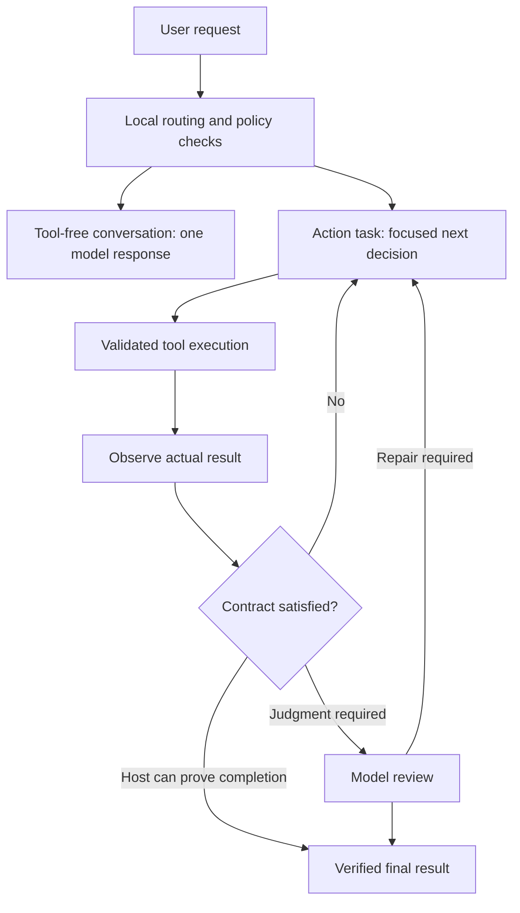

# Klyne performance plan

Date: 2026-09-17, addendum 2026-09-18. Status: second increment implemented 2026-09-18 (Stage-1 trace with request/model/tool/observation IDs, stage timers and milestones; Stage-2 host-contract review skip, verified file task 4 → 3 model calls; Stage-5 pulse endpoint with seq-based UI refresh; Stage-6 shared HTTP transport). Ledger: `docs/perf-ledger/2026-09-18-stage1-2-5-6.md`. Validation: 98 unit + 43 chat integration + 4 new perf tests + runtime/supervisor/studio/site/workspace/JS suites green (two single-test parallel flakes recorded, not excluded). No real-model latency benchmark yet; no speedup percentage claimed. Remaining: paired real-model runs, token-aware selection, SSE, read-batch primitive.

### First implementation increment

Implemented in source after the proposal:

- Fresh, standalone greetings use one model call with a compact prompt and no screenshot or tools. Existing conversations, action requests, pending work, and acceptance contracts retain the normal route. This is intentionally narrower than general question answering.
- `execution.model_timings` stores the latest 128 model attempts for the current goal: role, attempt number, wall time, serialized text prompt bytes, transport status, and optional Ollama load/prefill/generation/cache metrics. Missing metrics remain unknown. No prompt text is recorded in these samples; images are not included in the byte metric. Transport success does not imply a valid model decision.
- The complete text request is checked on every attempt after policy, diagnostics, secret scrubbing and retry feedback. Old observations and old messages can be dropped; the goal, newest observation and last two messages are preserved. Oversized protected content fails explicitly. This remains a byte budget, not token-aware compression.

Not yet implemented: full tool/storage/UI latency tracing, benchmark distribution reports, general conversation routing, token-aware prompt selection, streaming, scorer integration or parallel tool execution. No real-model speedup percentage has been measured.

Validation: 95 Studio unit tests, 2 supervisor tests, 43 chat integration tests and 1 public demo browser test passed; 5 subprocess/live fixtures were ignored as declared by their suites. Browser/desktop integration runs required execution outside the sandbox. The first sandbox integration run was interrupted after fixture failures; the complete rerun passed. Runtime activation reports candidate `2c5858a9610e398748e72dd25c605de731553fc3f0ca90369b8a681cf5079da1` active with no rollback.

## Objective

Reduce time from a user request to a verified outcome, while retaining autonomous discovery, accurate results, cancellation, and recovery. Track perceived responsiveness separately: an early status update does not mean the task finished faster.

## What the paper contributes

[On the Anatomy of Attention](https://arxiv.org/pdf/2407.02423), especially Sections 3.2 and 5 and Appendix C, studies attention architectures through computational diagrams and rewrites. After choosing a kernel-based similarity, reassociating multiplication reduces sequence-length complexity while preserving that chosen computation. This is not an exact replacement for arbitrary softmax attention. The experiments compare 14 variants trained from scratch on Penn Treebank; sequence length is only 35, and the authors report no observed linear-attention speed advantage in that setting.

My engineering interpretation for Klyne is to expose the execution graph, remove redundant work, and measure alternative arrangements. The paper does not demonstrate an agent-harness speedup. Replacing attention inside the current GGUF model would require compatible architecture, weights, and inference support. It is a separate research project from the changes below.

## Findings from the current implementation

These are code observations, not measured bottleneck rankings.

| Area | Evidence | Candidate improvement |
| --- | --- | --- |
| Model rounds | `src/chat.rs::drive_inner` normally plans, runs a worker, then reviews; even a simple conversation can traverse three model calls | Direct conversation route; selective host verification |
| Prompt size | `src/chat.rs::request` includes history, evidence, policy, capabilities and diagnostics; its 90,000-byte trimming loop precedes additional context fields | Budget the complete request; select relevant context |
| Model response | `src/connections.rs` sends Ollama `stream:false`; retains token counts but not inference timing fields | Stage timings and incremental transport |
| UI delivery | `web/chat.js` polls every 1,500 ms | Event updates with reconnect and snapshot fallback |
| Scheduling | `src/execution_graph.rs` explicitly uses a serial DAG scheduler; chat has one pending action | Bounded independent read batches after a state-model change |
| HTTP | `src/network.rs::send` constructs a Tokio runtime and client per call | Reuse transport after measuring setup costs |
| Persistence | `src/chat_store.rs` opens SQLite for operations and upserts history during saves | Incremental writes while retaining durable checkpoints |

Paths above are relative to `apps/studio/`. A read-only hardware query found an RTX 4060 Laptop GPU with 8,188 MiB VRAM. This is a capacity constraint, not evidence that GPU memory is currently the bottleneck.

## Execution design

This is the proposed flow. Complex tasks keep explicit planning. Route selection must not introduce another model round or rely on model confidence as authorization.

## Delivery sequence

### 1. Establish a latency baseline

Files: `chat.rs`, `connections.rs`, `network.rs`, `chat_store.rs`, and a new benchmark script/report.

- Assign request, model-call, tool-call and observation IDs. Use monotonic timers for preparation, model request, tool execution, verification, database checkpoint, and frontend delivery.
- Record time to first useful feedback, first valid action, and verified completion. Include retries, unnecessary questions, failure rate, input/output tokens, and model calls per task.
- Preserve optional Ollama load, prompt-evaluation and generation durations, plus cached-token counts when supplied. Older servers may omit fields. Keep these separate from budget accounting. The fields and streaming contract are documented in the [Ollama chat API](https://docs.ollama.com/api/chat).
- Compare cold and warm runs separately. Record model digest, backend version, context configuration, GPU offload, available memory and laptop power mode. Record metadata rather than raw private prompts.
- Use repeatable tasks: greeting, short question, directory listing, create-and-verify a file, browser profile discovery in a fixture, multi-step repair, long conversation, cancellation and restart after an uncertain action. Test messaging against a local fixture.
- Start with five paired warm repetitions per representative task and three cold runs. Treat tail estimates as preliminary; collect at least 30 comparable runs per key latency class before using p95 as a release gate. Report failures rather than excluding them from latency results.

Deliverable: a breakdown showing where time is spent. Deterministic fixtures validate orchestration; real-model runs measure inference latency. Follow the paired-run reporting protocol in addendum §A6 and the experiment-ledger practice in §B.

### 2. Remove unnecessary model rounds

Files: `chat.rs`, `execution_graph.rs`, `completion_guard.rs`, relevant integration tests.

- Add a tool-free conversation route that needs one model call. It cannot dispatch tools or claim an external action succeeded. Requests requiring tools fall through to the action route.
- Allow straightforward action tasks to start with the existing worker decision without a separate planning round. Ambiguous or multi-step requests retain planning.
- Replace a model review only where a host-side completion contract can prove the requested result from fresh evidence. Start with narrow file/read fixtures; retain judgment-based review elsewhere.
- Continue discovery when a requested fact is available through tools. For the original Chrome scenario, inspect profile metadata or the visible profile menu rather than ask the user to repeat the supplied name. Account ambiguity still requires resolution before acting.
- Preserve policy checks, exact user constraints, stop handling, budgets, target freshness and uncertain-effect recovery on every route.

Acceptance: trivial conversation goes from three model rounds to one; action regression fixtures still reject unsupported completion. This is a reduction in calls, not a promised threefold wall-clock speedup.

### 3. Reduce repeated prompt work

Files: `chat.rs::request`, `capabilities.rs`, `diagnostics.rs`, provider adapter.

- Assemble all fields before enforcing the final request budget. Use provider-compatible token counting where available, otherwise a conservative estimate calibrated against reported counts; bytes alone are not tokens.
- Supply role-relevant tool schemas and relevant evidence rather than every enabled route's detailed instructions. Keep a compact capability index so tools remain discoverable.
- Protect the original request, permissions, unresolved effects, current task contract and freshest target evidence from trimming. Retrieve older details by reference when needed.
- Remove duplicated goal text and stale observations. Do not add a summarization model call to every turn; summarize only when measured future savings justify it.
- Keep stable prompt sections stable. Cache schema assembly by tool/configuration/policy version. Treat inference-cache benefit as something to measure, not assume.

Acceptance: target 50% fewer input tokens for short-task fixtures without losing required constraints or tool discovery. Recheck long-history and correction cases.

### 4. Tune local inference against the actual hardware

Files: `connections.rs`, connection configuration/UI, benchmark matrix.

- Benchmark the current model first. Sweep practical context allocations, such as 8K, 16K and 32K, while ensuring each actual request fits. Larger tasks need explicit expansion or evidence retrieval, not silent truncation.
- Add bounded generation budgets by role, with explicit handling of truncated/invalid decisions. Keep one active local inference initially to avoid contention.
- Evaluate a configurable warm-model idle period. Ollama supports request-level `keep_alive`; account for competing workloads and memory pressure.
- Inspect backend/version support before testing FlashAttention and KV-cache precision. Current Ollama documentation says supported backends enable FlashAttention automatically; forcing it may add nothing. KV quantization is a global server setting and requires quality testing. See the [official FAQ](https://docs.ollama.com/faq).
- Keep model changes as an explicit configuration choice, evaluated for tool-call accuracy and verified completion. A smaller model that requires more retries can be slower overall.

Acceptance: choose the fastest configuration meeting the quality gate and memory headroom. FlashAttention optimizes attention execution; it is distinct from the paper's linear-attention architecture.

### 5. Deliver useful feedback immediately

Files: `connections.rs`, `network.rs`, server event endpoint, `web/chat.js`, activity reducer.

- Emit immediate acknowledgement and truthful stage transitions. Stream user-facing answer text where the response protocol supports it.
- Consume model transport incrementally, but validate complete structured decisions before executing any tool. Do not display raw decision JSON or internal reasoning as progress.
- Replace normal 1.5-second polling with sequenced server events. Reconnect from a known sequence or fetch a fresh snapshot; retain polling as fallback.
- Coalesce rendering and persist completed messages and critical transitions rather than every token. Cancellation must terminate stream consumption promptly.

Acceptance: target under 200 ms p95 from a locally emitted event to its visible UI update, measured separately from inference. Test disconnects, duplicates, cancellation and hidden-tab recovery.

### 6. Optimize tool and storage overhead where measurements justify it

Files: `execution_graph.rs`, `chat.rs` pending-action representation, tool metadata, `network.rs`, `chat_store.rs`.

- Introduce an explicit independent read-batch primitive with initial concurrency two. Give each operation its own IDs, budget reservation, result and cancellation state. Validate dependencies and conflicting resources in the host.
- Keep shared desktop interaction and state-changing operations serial. A tool's name or model assertion is insufficient to establish read-only behavior. Future tools default to serial until their effect/resource metadata is reviewed.
- Reuse HTTP connections and runtime infrastructure while preserving cancellation, response caps, redirect policy and per-request deadlines.
- Write only new history rows and changed metadata. Preserve durable pre-dispatch records, uncertain-outcome journals and transaction integrity; retain SQLite durability settings.
- Cache only data with explicit invalidation. Desktop targets and observations require freshness; stale evidence cannot prove completion.

Acceptance: demonstrated end-to-end improvement for the affected task class, with no duplicate effects, stale-target actions or restart regressions. Do not parallelize the existing single-pending-action implementation directly.

## Additional experiment: Jevlike option scoring

Reviewed 2026-09-17 at commit `94f5fd1b0b11d52bbdfdf4e0ee6aa96b568f8452`.

[Jevlike](https://github.com/vinnylarouge/jevlike) is an independent research starter that scores a supplied menu of text options without autoregressive answer generation. Its README reports roughly 98% synthetic-menu accuracy but only 26-29% on target-disjoint Wikispeedia tasks. The reported roughly 100-fold timing comparison uses eight options against a small decoder forced to generate 400 tokens; it is not a Klyne benchmark. Default byte inputs truncate context to 192 bytes and options to 32 bytes. These limits would discard important information in many Klyne tasks.

The inspected [model implementation](https://github.com/vinnylarouge/jevlike/blob/94f5fd1b0b11d52bbdfdf4e0ee6aa96b568f8452/jevlike/model.py) computes option-conditioned attention over context and returns masked logits. Its tiny encoder averages option byte embeddings, losing their ordering; the frozen-transformer version encodes context and options separately. Consequently, the latter still incurs transformer encoding cost. Neither implementation supplies a trained Klyne policy, completion verifier or permission system.

### Proposed scope

Add this experiment after the baseline and prompt-budget work. Start with advisory ranking of relevant evidence or tool descriptions, where the existing worker still makes and validates the final decision. Evaluate conversation/action routing later. Do not use scorer probabilities to grant permissions, assert completion, select an ambiguous account, or send a message.

The host constructs a menu of valid candidate IDs with descriptions, prerequisites and an explicit fallback option. A scorer selects or ranks existing candidates; it cannot invent a tool or its arguments. Validate candidate IDs against the exact menu version before consuming results. A low score margin, missing candidate, unsupported input length, unhealthy scorer or unfamiliar task returns to the existing route. Softmax confidence alone is not a calibrated guarantee.

### Experiment steps

1. Collect scrubbed decision examples from verified Klyne trajectories. Label the appropriate candidate using observed task outcomes and review; do not treat every historical model choice as correct. Include ambiguous cases and cases where no candidate is appropriate.
2. Split by task family, application/page and session before training, keeping related trajectories together. Reserve an untouched test set. Include held-out tools to assess changing menus.
3. Compare deterministic matching, a lightweight classifier, a Jevlike-style scorer, and the current model making a concise selection. Include candidate construction, encoding, process startup, fallback and downstream retries in timing. Do not force the baseline to generate unnecessary tokens.
4. Start with CPU inference to avoid competing with the main model on the 8 GB GPU. Measure resident memory and startup cost. A persistent scorer is justified only if its total overhead is lower than the work saved. Cache option embeddings only by encoder/checkpoint and exact description version.
5. Run in shadow mode first: record rankings while the existing route remains authoritative. Measure candidate recall, top-k accuracy, calibration, abstention coverage, inappropriate fast-route selection, and time to verified outcome.
6. Enable advisory ranking behind a feature switch only after held-out task outcomes remain acceptable. Retain broad tool discovery when the shortlisted options cannot solve the task. Adding a tool must not require trusting an unvalidated prediction.

### Validation and promotion

Exercise shuffled menus, duplicate or near-identical labels, negation, Unicode, long inputs, missing correct options, changed tool schemas, and instructions embedded in tool output. Test scorer timeout/crash fallback and checkpoint/version mismatch. Resolve checkpoint loading and model licensing before importing artifacts; the inspected loader uses Python pickle-capable loading, so public checkpoint files should not enter the runtime through that path unreviewed.

Promote only if end-to-end performance improves over the simpler baseline at equivalent observed task quality. Explicitly report how often fallback occurs. Ranking that merely adds an extra model invocation without shrinking later work should be rejected. No Jevlike code, dependencies or checkpoints were installed as part of this planning update.

## Addendum 2026-09-18: jev-ultrafast, Agora, RSI — what transfers

Three external references were reviewed against this plan. Verdict: adopt
jev-ultrafast's decision-loop and measurement discipline as concrete amendments
to Stages 1, 2, 3 and 6; adopt Agora as a lightweight experiment-ledger practice,
not a system to install; treat RSI as a boundary that justifies the existing
improvement gates, not new work. Nothing below changes the release gates'
quality requirements or claims a measured Klyne speedup.

### A. jev-ultrafast (browser-use/jev-ultrafast) — adopt the loop, not the numbers

What it is: a browser agent with a dynamic, indexed action space. One TypeSafe
`Jev` request returns an operation plus speculative per-kind targets
(`click_target`, `type_text_target`, `select_target`) in a single network round
trip; only the matching target can execute. A small LLM generates text only when
the operation is `TYPE_TEXT`, and its output must parse as a small JSON object
before typing. Reported evidence: 7.073 s Google Flights run; six alternating
runs on one task/profile gave median 9.450 s → 7.092 s (25%), TypeSafe requests
22 → 17, browser protocol calls 1,092 → 101. The authors state this is three
pairs on one task (two-sided sign-test p = 0.25), not a general benchmark, and
retain development attempts, source hashes, token counts, and separate
text-helper cost ($0.00006272 for two calls — text-helper charge only).

Applicable to Klyne, mapped to existing stages:

- A1. Single-decision browser cycle (amends Stage 2). Where Klyne currently
  traverses plan → worker → review, the browser/desktop action route should move
  toward one structured decision per cycle: operation + indexed target +
  DONE/BLOCKED in a single model call, with text generation only on fill
  operations. Klyne cannot assume a hosted scorer: the decision model is the
  configured local model, and any text-helper split must use an explicitly
  configured fast model with JSON validation before input. `DONE` still requires
  independent host verification (existing `completion_guard.rs`); scorer-style
  confidence never authorizes completion.
- A2. Atomic snapshot, one browser call per observation (amends Stage 6). Adopt
  a single-call structured snapshot primitive: read visible controls, names,
  values and text atomically and keep references to the underlying nodes, instead
  of repeated accessibility-tree reads and per-node resolution. Count browser
  protocol calls per task as a first-class metric; the 1,092 → 101 reduction is
  the class of win to look for, not a Klyne forecast.
- A3. Target validation before input (amends Stage 6). Adopt click guards that
  compare the selected target, nearby context, document and form state; resolve
  current geometry and reject covered controls before acting. Animation alone
  must not force re-prediction. Model output must never become selectors,
  coordinates, shell commands, or executable JavaScript — consistent with the
  existing authority broker.
- A4. Bounded post-action waits (amends Stage 6). Adopt explicit wait budgets:
  after typing into a combobox, wait for suggestions capped at ~200 ms; other
  interactions get at most ~two animation frames / 50 ms. Reads happen after
  execution is logged, and stale-page retries reuse a generated text value only
  if the entire helper input is unchanged.
- A5. Visible text only in evidence (amends Stage 3). Offscreen article bodies
  and footers do not enter model context. Screenshots stay out of the default
  action loop (as greetings already do); they are inspector/opt-in artifacts.
- A6. Paired-run measurement protocol (amends Stage 1). Copy the reporting
  discipline: alternating paired runs on one task/profile, frozen baseline
  source hash, identical model/settings/viewport/budgets, initial navigation
  excluded in both arms, all attempts included with verification outcomes,
  per-stage timings (prediction, text generation, browser work, loading),
  protocol-call counts, token counts separated from dollar cost and from browser
  cost, and retained development attempts (including failures) alongside the
  matched comparison.

Explicitly not adopted: TypeSafe/OpenRouter dependencies (Klyne is local-first);
treating 25% or 7 s as a Klyne target; the MVP's unsupported surface (shadow
roots, frames, canvas, uploads, pop-up tabs, nested scrolling, arbitrary
keyboard widgets) as acceptable Klyne regressions — Klyne's desktop/multi-app
scope keeps its existing fixtures authoritative.

### B. Agora (arXiv:2609.18094, Zhang et al., NVIDIA) — adopt as ledger practice

What it is: Git-as-shared-memory for collective auto-research. Every claim is an
immutable commit in an append-only DAG with parent edges ("builds on"); a
derived index exposes frontier, neglected branches, and verification status;
quality comes from downstream reproduction/use (with self-citation excluded),
not votes; diversity-aware ranking keeps workers off one monoculture. Reported
run: 13 workers, ~12 days, 1,703 contributions on a no-training weight-transfer
task (3.39 → 1.899 bits/byte); 165 independent reproductions, none failed; one
mid-run human intervention (showing workers their concentration map) broke a
five-day monoculture within a day. The authors state the run does not settle
whether shared state improves discovery per compute — the matched comparison is
future work (Appendix C).

Applicability to Klyne: process only, not runtime latency. The task
(weight-transfer bpb) is unrelated to agent latency, and Klyne perf work is
single-repo engineering, not a 13-worker autonomous fleet. Do not install the
Go/Next.js prototype or spawn parallel research workers.

Adopted as a lightweight experiment ledger (amends Stage 1 process):

- B1. Each perf experiment is one reviewable unit recording parent (what it
  builds on), a predicted outcome band stated before measuring, the single
  change made, the measured result with evaluator/seed/hardware, and named
  follow-ups. Publish negative results with scores and explanations.
- B2. Promotion requires independent reproduction: a second run (different
  session/hardware where available) within a stated tolerance, recorded
  alongside the claim. Same-hardware bit-identity is expected; cross-hardware
  variation must be reported, not averaged away.
- B3. Periodic diversity review: check the ledger for monoculture (all effort
  refining one basin, e.g. only context-size sweeps) and explicitly schedule
  explore-novel work (thin clusters, neglected branches) alongside exploit work
  (refining leaders). Treat the review, not a leaderboard, as the scheduler.
- B4. No claim of causal discovery speedup from the ledger itself; it is filing
  discipline that makes verification and audit possible.

### C. Recursive self-improvement (Schmidhuber, IDSIA survey) — boundary, not a stage

What it is: a historical survey of RSI since 1987 — meta evolution, incremental
self-improvement with self-modifying policies and the Success-Story Algorithm
(keep self-modifications that accelerate reward intake), gradient-based
self-referential networks, OOPS curriculum reuse, the Gödel Machine (rewrite
only on proof of usefulness), curiosity/PowerPlay goal invention, and modern
LLM-based variants. Full RSI is framed as requiring self-improving hardware,
not just software.

Applicability to Klyne: justificatory, not constructive. No RSI mechanism is a
latency technique to implement under this plan:

- C1. The existing `improvement.rs` gate already encodes the transferable
  principle (success-story / Gödel-style): candidates run in an isolated Git
  worktree, existing tests and build config are frozen, promotion requires an
  independent acceptance test going failure → success with all regression gates
  passing, passing changes stay on a `klyne/<id>` branch for review and are
  never auto-merged, activation goes through `runtime_stage` with rollback.
  Perf stages keep this gate unchanged.
- C2. No autonomous production self-rewrite under this plan. No perf change may
  modify the running harness by assertion; reports are historical evidence, never
  authority (existing instruction text stands).
- C3. Curiosity-driven goal invention (PowerPlay-style self-assigned tasks) is
  explicitly out of scope: perf work follows this plan's task list and the
  ledger's named follow-ups, not self-generated goals.
- C4. OOPS-style reuse maps to already-planned work (cached schema assembly in
  Stage 3, durable checkpoints) and needs no separate stage.

## Release gates and rollback

Ship the six stages as separate reviewable changes, with feature switches for routing, prompt selection, inference options and concurrency. Steps 1-3 have priority; use their measurements to reorder later work.

- Aspirational target: 30-50% lower median verified-completion time on common warm tasks. This is a target, not a forecast or measured result.
- Require no new authorization, duplicate-effect, false-completion or secret-handling failures in the regression suite.
- Compare real-model task success, retries and unnecessary clarification rates against the same baseline; document sample size and variation. Passing a small suite does not prove universal accuracy. Report paired runs per §A6 with baseline hash, protocol-call counts, and retained development attempts (including failures); separate token counts from dollar and browser costs.
- A `DONE` decision is never evidence of success on its own; promotion requires independent host verification (§A1) plus an independent reproduction (§B2).
- Reject a change that improves first-token latency while materially worsening verified completion or success rate. Investigate a greater than 10% p95 regression in a comparable task class before promotion.
- Run affected Rust, JavaScript and recovery tests plus the established runtime activation checks. Keep the previous runtime available for rollback.

The first implementation milestone is instrumentation plus the one-call conversation route and complete-request context budgeting. It provides measurable speed gains without depending on training a new attention architecture.
